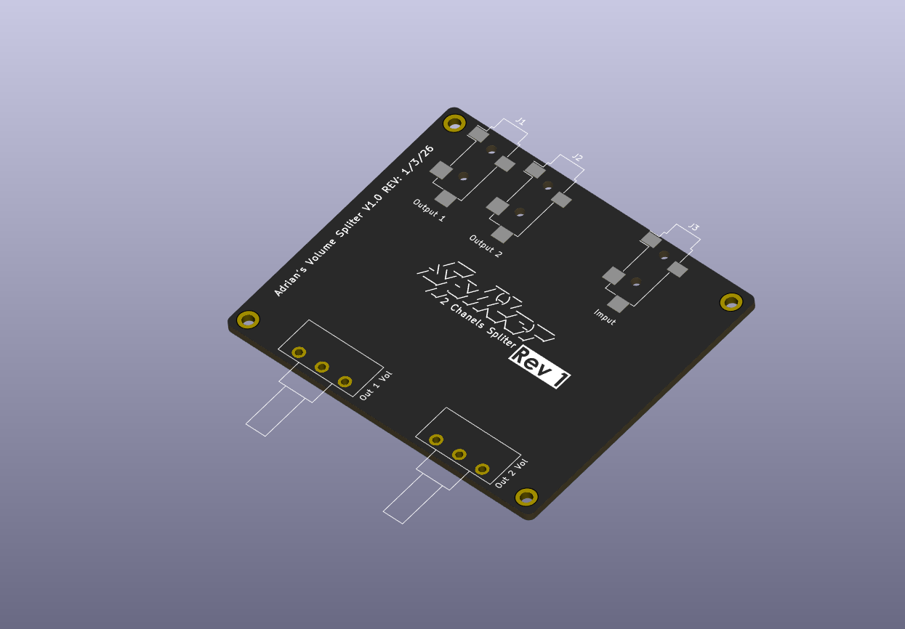
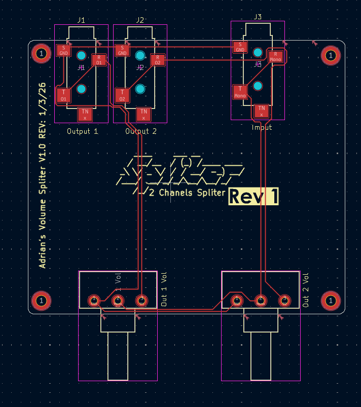
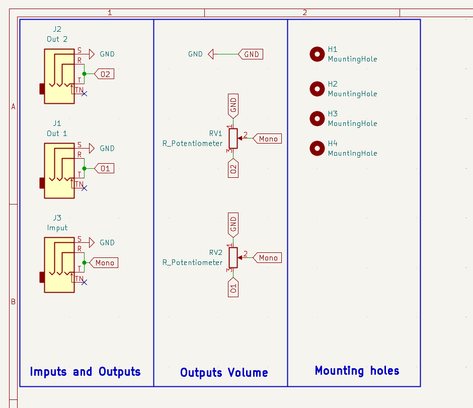

# 🎛️ Adrian's Volume Splitter V1.0

A simple passive 2-channel mono audio splitter. Connects a single audio source and splits it into two separate outputs. Both outputs have their own volume control.

To use this module, plug your audio source into the **Input jack (J3)**. Then plug your two devices into the **Output 1 (J1)** and **Output 2 (J2)** connectors. Finally, use the two pots **RV1** and **RV2** to adjust the volume of each output independently. Works best if your devices have a kind of preamplifier.

This module is a response to my own need for an inexpensive way to share a single audio source between two devices at once. I made this module, it works perfectly for my needs, so I made a nice PCB for it too.

> This is a mono splitter. This splitter does not separate left/right stereo channels. Both channels are combined into a single mono signal.

---

## Previews

### 3D Model

### PCB Layout

### Schematic

---

## BOM

| # | Component | Value / Description | Qty | 
|---|-----------|---------------------|-----|
| J1, J2 | TRS Jack | 3.5mm or 6.35mm Through-Hole Stereo Jack (Output) | 2 
| J3 | TRS Jack | 3.5mm or 6.35mm Through-Hole Stereo Jack (Input) | 1 
| RV1, RV2 | Potentiometer | R_Potentiometer, panel mount (e.g. 10kΩ) | 2 
| H1–H4 | Mounting Hole | M3 screw hole, no copper | 4 
| — | PCB | Adrian's Volume Splitter V1.0, Rev 1 | 1
---

